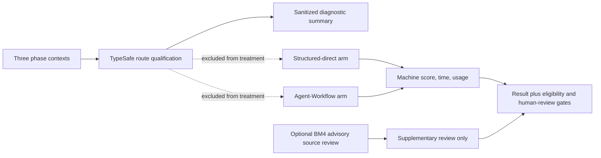

# Agent-Workflow Benchmark Results

Public, reproducible benchmark results for [Agent-Workflow](https://github.com/ngallodev-software/agent-workflow).

This repository stores **results and finished software**, not the benchmark harness itself. The harness lives in [agent-workflow-benchmark](https://github.com/ngallodev-software/agent-workflow-benchmark).

## Purpose

The benchmark program measures whether Agent-Workflow's lifecycle, orchestration, evidence, review, and recovery mechanisms justify their runtime and token cost. Each published benchmark preserves enough public evidence to inspect the treatment design, finished software, machine scoring, timing, token usage, and limitations.

The intended engineering loop is:

```text
instrument -> benchmark -> diagnose -> optimize -> re-benchmark
```

## Published / planned studies

| Study | Comparison | Status | Purpose |
| --- | --- | --- | --- |
| Round 2 | `raw-direct/v1` vs `agent-workflow-full/v1` | Historical development smoke | Establish initial wall-time/token overhead |
| BM3 | `structured-direct/v1` vs `agent-workflow-full/v1` | Execution complete; visual/human review pending | Isolate lifecycle/orchestration overhead from structured prompt discipline |
| BM4 | `structured-direct/v1` vs `agent-workflow-bm4/v1` | One eligible pair; descriptive development result | Measure early context/execution optimization effects |
| BM5 | `structured-direct/v1` vs `agent-workflow-bm5/v1` | One eligible pair; awaiting human review | Measure steering-first lifecycle and later execution/context optimizations |

## Current paired measurements

These are single-pair development observations, not generalized effects. BM3's machine score delta is descriptive only because visual-capture evidence is missing; BM5 has zero human-complete pairs and awaits review. Cost evidence is unavailable for BM5.

| Study | Machine score delta | Wall-time delta | Provider-token delta | Eligibility / qualification |
| --- | ---: | ---: | ---: | --- |
| BM3 | +4.0 | +935.505 s | +2,345,986 | 0 eligible pairs (missing required visual evidence); TypeSafe qualification 3/3 successful |
| BM4 | +6.5 | +428.667 s | +2,630,657 | 1 eligible pair; TypeSafe qualification 3/3 route matches |
| BM5 | -2.5 (82.5 vs 80.0) | -185.003 s | -235,308 | 1 eligible pair, 0 human-complete; awaiting human review; TypeSafe qualification 3/3 route matches |

BM5's supplementary product score was 79.5 direct vs 77.5 Agent-Workflow (-2.0). The paired Agent-Workflow arm used 185.003 fewer wall-clock seconds and 235,308 fewer provider tokens, while scoring 2.5 fewer machine points. Time savings were concentrated in implementation (456.8 s vs 772.5 s); analyze-plan and verify-repair were slower. These results suggest a possible efficiency/quality tradeoff worth repeating, not a winner or a causal estimate. See each study README for its full metric table and evidence limits.

## How Jev/TypeSafe appears in these studies

Agent-Workflow uses the TypeSafe SDK `system_one` interface with bounded `Choice`, `Noul`, and `Score` questions. The benchmark runners make one pre-treatment routing-qualification call for each of the three phase contexts. They publish sanitized summaries and keep raw request/response audits private. Qualification is outside both paired arms, so none of the reported score, timing, or token deltas measures the effect or cost of TypeSafe routing.



The qualification evidence records three successes for each study: BM3 had one task-class disagreement under shadow disposition and semantic-risk uncertainty fallback in all three phases; BM4 and BM5 matched deterministic route recommendations in all three phases. BM4 also contains separate advisory TypeSafe source-review experiments; these do not affect its benchmark score or eligibility. No benchmark presently demonstrates that Jev/TypeSafe improves product quality or reduces execution cost.

Official background: [Jev/System One announcement](https://typesafe.ai/blog/introducing-system-one-models-and-jev), [System One](https://docs.typesafe.ai/concepts/system-one.md), [state](https://docs.typesafe.ai/concepts/state.md), [Choice](https://docs.typesafe.ai/primitives/choice.md), [Noul](https://docs.typesafe.ai/primitives/noul.md), [Score](https://docs.typesafe.ai/primitives/score.md), and [Python SDK](https://docs.typesafe.ai/sdk/python.md).

## Repository layout

```text
historical/round2/    sanitized historical baseline
bm3/                  BM3 task, outputs, metrics, analysis, qualification evidence
bm4/                  BM4 task, outputs, metrics, analysis, qualification evidence
bm5/                  BM5 task, outputs, metrics, analysis, qualification evidence
schema/               public result metadata schema
```

For completed studies, both treatment outputs are stored as ordinary source trees so readers can inspect the actual software produced rather than relying only on reported metrics.

See [METHODOLOGY.md](METHODOLOGY.md) and [EVIDENCE_POLICY.md](EVIDENCE_POLICY.md).

## Claim discipline

Development runs are descriptive. A single paired run does not establish a generalized winner or treatment effect. Published summaries must identify sample size, treatment identity, environment, scoring eligibility, and known limitations.
